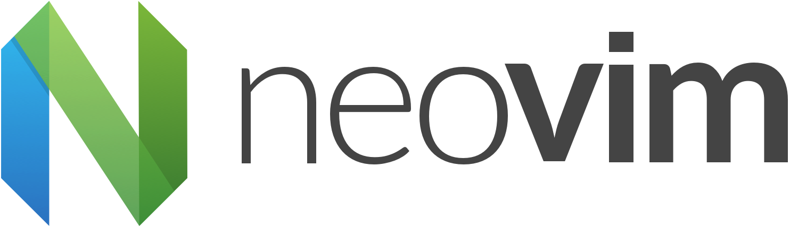

# nvim_setup



**1. Use the package manager choco to install NeoVim.**

```bash
choco install neovim
```
**2. Neovim config file**

Make a `init.vim ` file at location `~/AppData/Local/nvim`

**3. vimrc configuration**

Add your `vimrc` config in `init.vim`

**4. Install vim-plug**

```bash
md ~\AppData\Local\nvim\autoload
$uri = 'https://raw.githubusercontent.com/junegunn/vim-plug/master/plug.vim'
(New-Object Net.WebClient).DownloadFile(
  $uri,
  $ExecutionContext.SessionState.Path.GetUnresolvedProviderPathFromPSPath(
    "~\AppData\Local\nvim\autoload\plug.vim"
  )
)
```
**5. Write your plugins**

```vim
call plug#begin('~/AppData/Local/nvim/plugged')
" below are some vim plugin for demonstration purpose
Plug 'joshdick/onedark.vim'
Plug 'iCyMind/NeoSolarized'

Plug 'vim-airline/vim-airline'
Plug 'vim-airline/vim-airline-themes'
call plug#end()
```